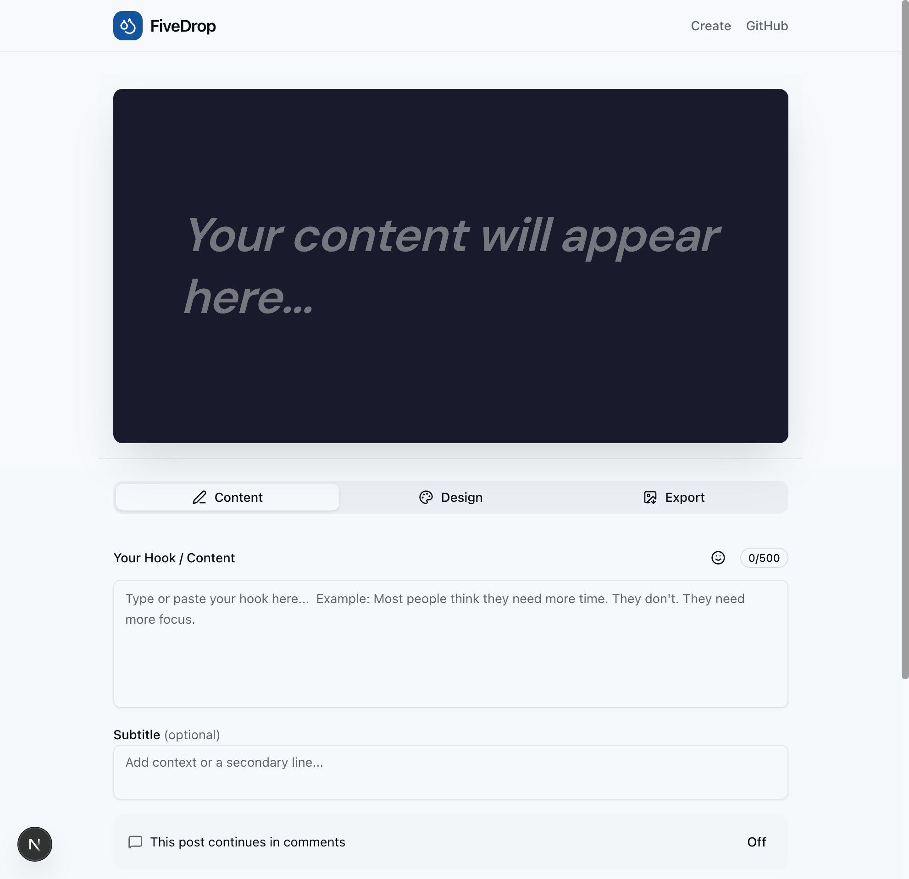

# FiveDrop

> 🎯 A lightweight content-to-image generator for social media creators

FiveDrop helps content creators transform text into beautiful, engagement-optimized images for Facebook, LinkedIn, X (Twitter), and Instagram. No design skills needed.

**Repository**: [https://github.com/abdulsamadola/fivedrop](https://github.com/abdulsamadola/fivedrop)




## ✨ Features

- **Lightning Fast** - Create images in under 5 seconds
- **Multiple Formats** - Hook Only, Hook → Comments, Thread Starter, Long Thought, List Drop
- **Platform Optimized** - Export sizes for Facebook, LinkedIn, X, and Instagram
- **Professional Design** - Clean typography, gradients, and color options
- **No Sign-up Required** - Start creating immediately
- **Mobile-First** - Works perfectly on any device

## 🚀 Quick Start

```bash
# Clone the repository
git clone https://github.com/abdulsamadola/fivedrop.git
cd fivedrop

# Install dependencies
npm install

# Run development server
npm run dev

# Open http://localhost:3000
```

## 🛠 Tech Stack

- **Framework**: Next.js 14 (App Router)
- **Language**: TypeScript
- **Styling**: Tailwind CSS v4
- **UI Components**: shadcn/ui
- **Image Generation**: html-to-image
- **Icons**: Lucide React

## 📁 Project Structure

```
src/
├── app/
│   ├── page.tsx           # Landing page
│   ├── create/
│   │   └── page.tsx       # Editor page
│   ├── layout.tsx         # Root layout with SEO
│   └── globals.css        # Global styles
├── components/
│   ├── ui/                # shadcn/ui components
│   ├── ContentInput.tsx   # Text input with emoji picker
│   ├── FormatSelector.tsx # Post format selection
│   ├── DesignPanel.tsx    # Design customization
│   ├── PreviewCanvas.tsx  # Live preview
│   ├── ExportPanel.tsx    # Download options
│   ├── Header.tsx         # Site header
│   └── Footer.tsx         # Site footer
└── lib/
    ├── types.ts           # TypeScript types
    └── utils.ts           # Utility functions
```

## 🎨 Post Formats

| Format | Use Case |
|--------|----------|
| Hook Only | Single powerful statement |
| Hook → Comments | Tease content, drive to comments |
| Thread Starter | Begin a longer narrative |
| Long Thought | Extended reflections |
| List Drop | Numbered points for scanability |

## 📱 Supported Platforms

| Platform | Dimensions | Aspect Ratio |
|----------|------------|--------------|
| Facebook | 1200 × 630 | 1.91:1 |
| LinkedIn | 1200 × 627 | 1.91:1 |
| X (Twitter) | 1200 × 675 | 16:9 |
| Instagram | 1080 × 1080 | 1:1 |

## 🔧 Development

```bash
# Run development server
npm run dev

# Build for production
npm run build

# Start production server
npm start

# Run linting
npm run lint
```

## 📝 Roadmap

### v1 (Current)
- [x] Text input with character counter
- [x] Emoji picker
- [x] 5 post formats
- [x] Font selection
- [x] Color/gradient backgrounds
- [x] Platform-specific export
- [x] Mobile-responsive design

### v2 (Planned)
- [ ] Custom background images
- [ ] Brand kit (save colors, fonts)
- [ ] Templates library
- [ ] Bulk generation
- [ ] API access

## 🤝 Contributing

Contributions are welcome! Please feel free to submit a Pull Request.

1. Fork the repository
2. Create your feature branch (`git checkout -b feature/amazing-feature`)
3. Commit your changes (`git commit -m 'Add some amazing feature'`)
4. Push to the branch (`git push origin feature/amazing-feature`)
5. Open a Pull Request

## 📄 License

MIT License - feel free to use this project for personal or commercial purposes.

## 🙏 Acknowledgments

- [Next.js](https://nextjs.org/) - The React Framework
- [shadcn/ui](https://ui.shadcn.com/) - Beautiful UI components
- [Tailwind CSS](https://tailwindcss.com/) - Utility-first CSS
- [Lucide](https://lucide.dev/) - Beautiful icons

---

Made with ❤️ for content creators who value their time.
